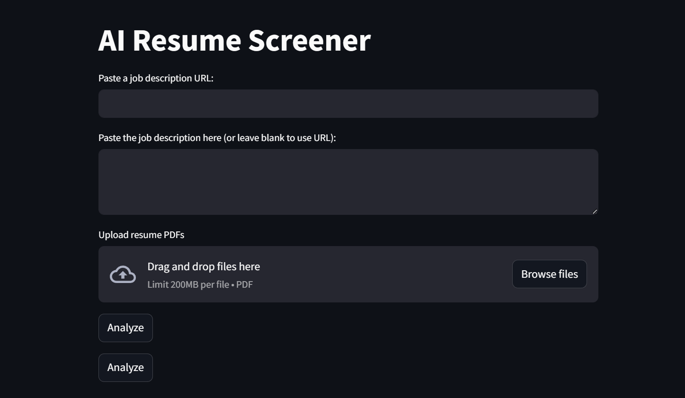

# AI Resume Screener

A Streamlit web app that scans PDF resumes, extracts key information, and ranks candidates against a job description. It uses Python, spaCy, sentence-transformers, and SQLite to provide a quick overview of applicant suitability.



## Project Structure
- `main.py` – Streamlit interface for uploading resumes and displaying ranked results.
- `resume_parser.py` – Parses resumes with spaCy and keyword heuristics.
- `jd_scraper.py` – Pulls job descriptions from a URL.
- `job_matcher.py` – Computes semantic similarity between resumes and the job description.
- `ranker.py` – Sorts candidates by similarity score.
- `database.py` – Stores candidate data in a local SQLite database.
- `resume-parser.py` – Alternative basic parsing example.

## Features
- Extracts skills, names, and degrees from PDF resumes.
- Accepts job descriptions via text box or URL (LinkedIn/Indeed).
- Ranks applicants by semantic similarity to the job description.
- Persists candidate data in `resumes.db` for later review.

## Installation
```bash
git clone <repo_url>
cd ai-resume-screener
pip install -r requirements.txt
python -m spacy download en_core_web_sm
```

## Usage
```bash
streamlit run main.py
```
Upload resume PDFs in the web interface and paste a job description or URL. The app will display a ranked list of candidates with extracted entities.

## Screenshot
Place a screenshot of the running app at `docs/app_screenshot.png` to showcase the interface.


